# Step-by-Step Example
This section shows a step-by-step example of how to download Anaconda, set up an environment, begin working with the environment, and run MyoSim.

1.	Download GitHub Desktop and follow installation instructions by visiting https://desktop.github.com/ and clicking the “Download for Windows” button.

 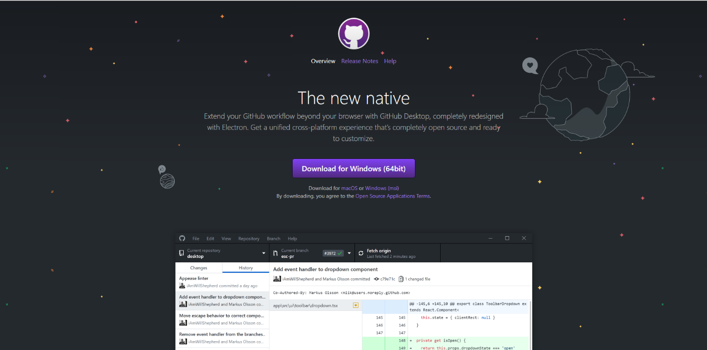

2.	Launch GitHub Desktop through the Start Menu.

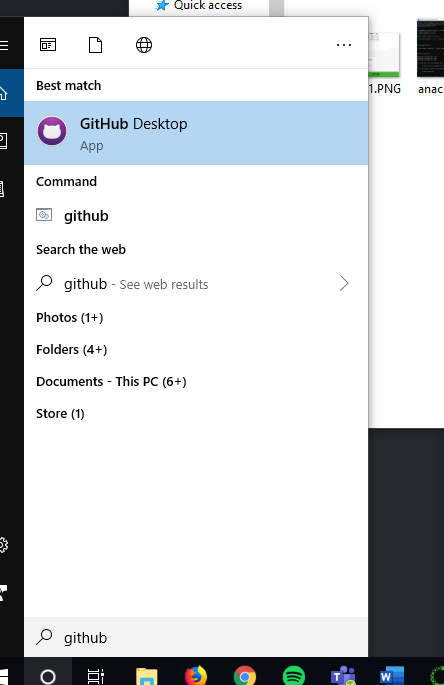

3.	Sign into your GitHub account when prompted.
4.	Click “File” then click “Clone Repository”.

 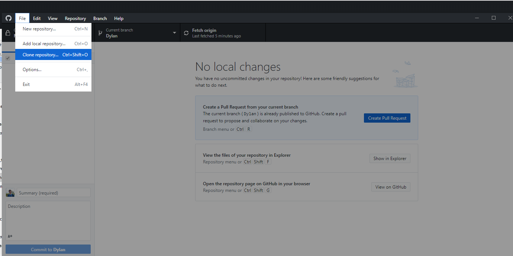

5.	Clone the Python_MyoSim repository.

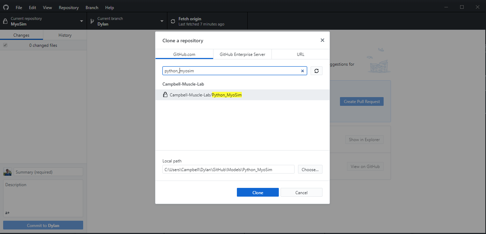 

6.	Download Anaconda - Go to https://www.anaconda.com/distribution/ and download the Python 3.7 version of Anaconda after clicking the “Windows” button.

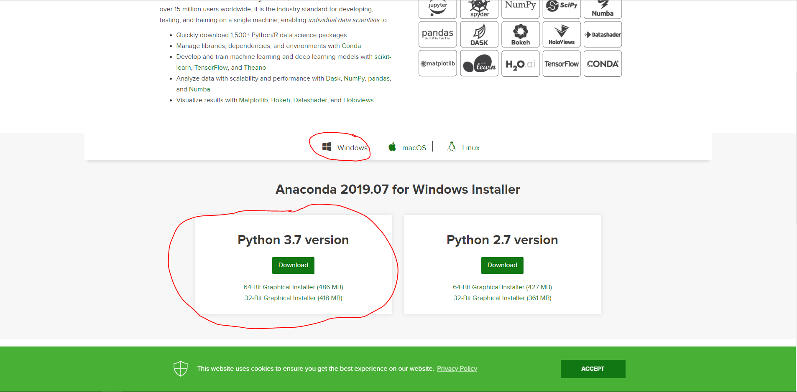 

7.	Follow the installation instructions prompted by the Anaconda installer and accept all default options.
8.	Launch the Anaconda Prompt from the Start Menu.

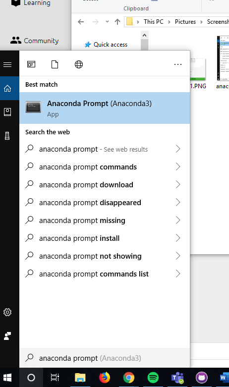

9.	Type `conda create –name <NAME_OF_YOUR_ENVIRONMENT>` where `<NAME_OF_YOUR_ENVIRONMENT>` is the name of the environment you would like to create. In this example, I’ve chosen `example_environment`. Type `y` for “yes” when you’re prompted to and hit <kbd>Enter</kbd> on your keyboard.

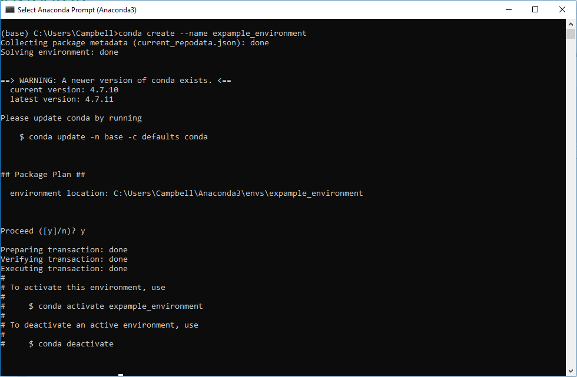

10.	Launch the Anaconda Navigator from the Start Menu.

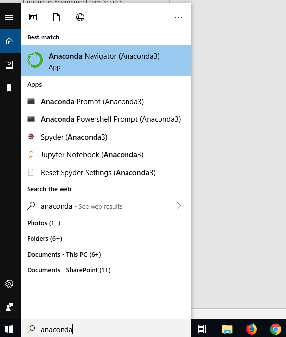

11.	 Change into the created environment by selecting it from the drop-down menu in the Anaconda Navigator.

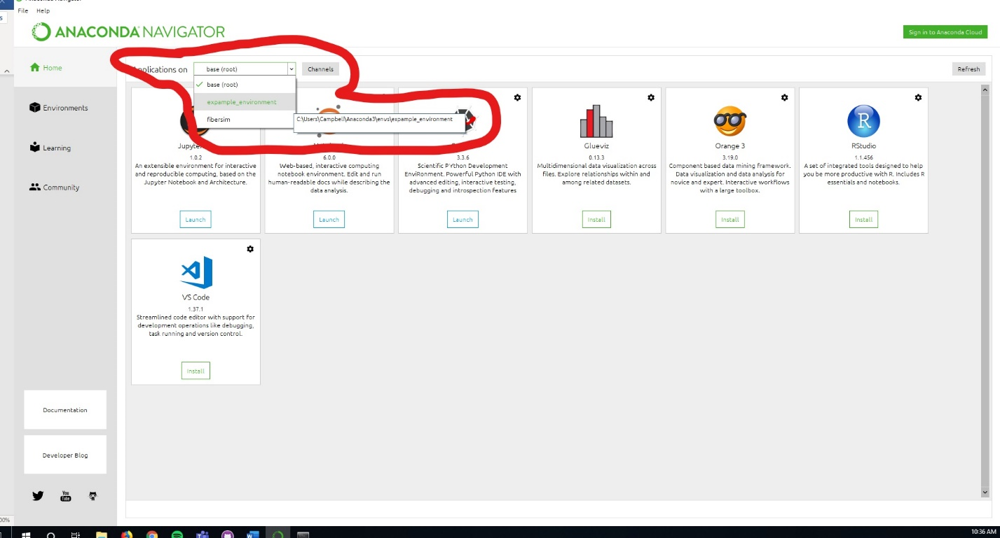

12.	Click the “Environments” button on the left panel of the Anaconda Navigator.

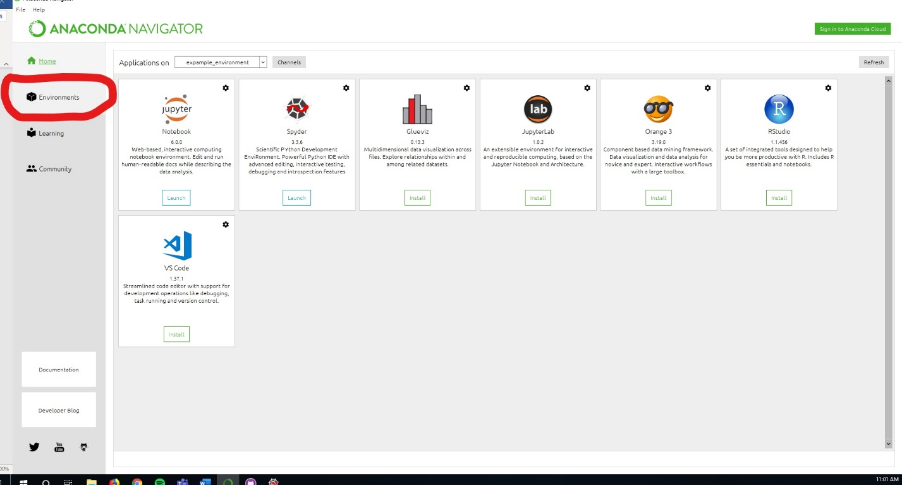

13.	Change the package view to “Not Installed” by selecting it from the drop-down menu.

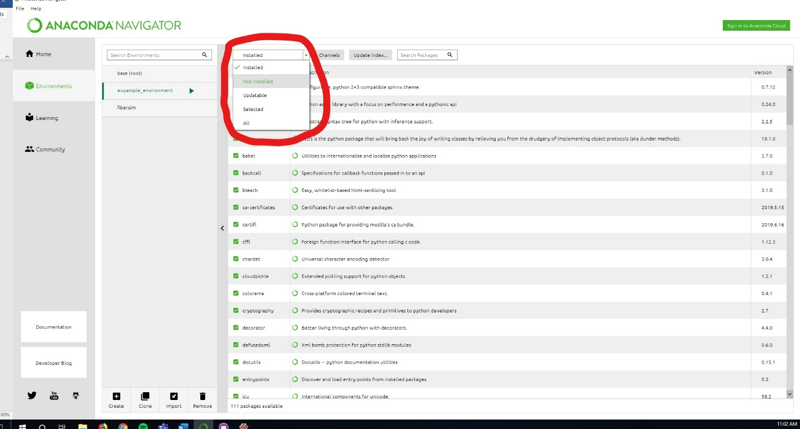

14.	Search for and click the check box of numpy package.

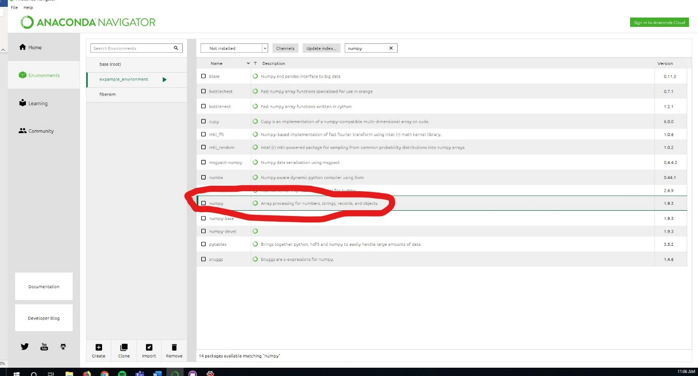

15.	Repeat step 14 for the following packages: “pandas”, “matplotlib”, “scipy”. 
16.	Click “Apply” on the bottom left of the screen and proceed through the prompts.
17.	Navigate back to “Home”.

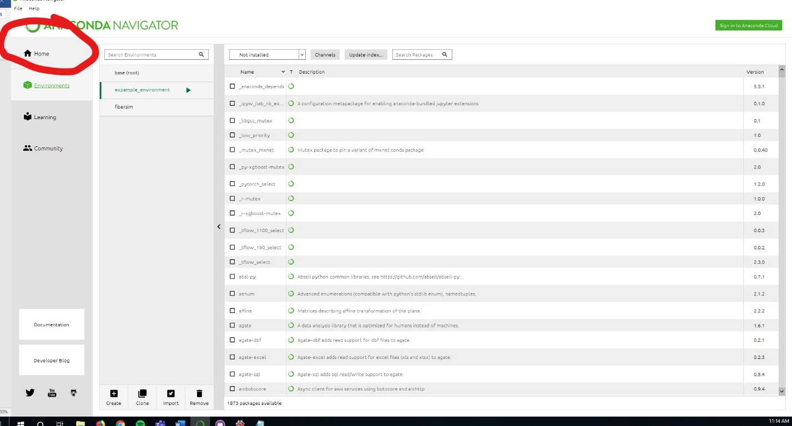

18.	Install Spyder and Jupyter Notebook by clicking “Install” for both applications.

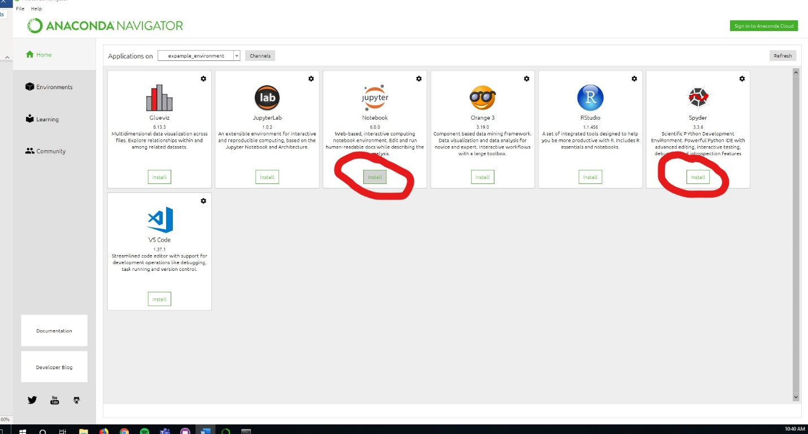

19.	Launch Spyder through the same Anaconda Navigator window after installation.

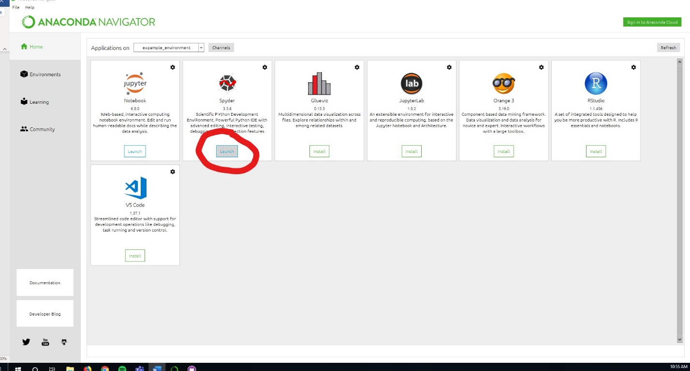

20.	Begin coding.